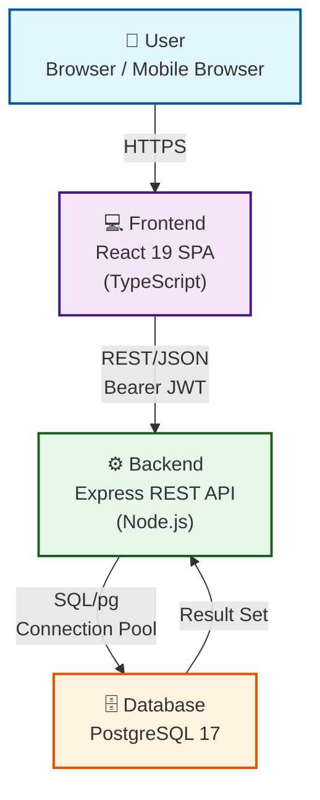
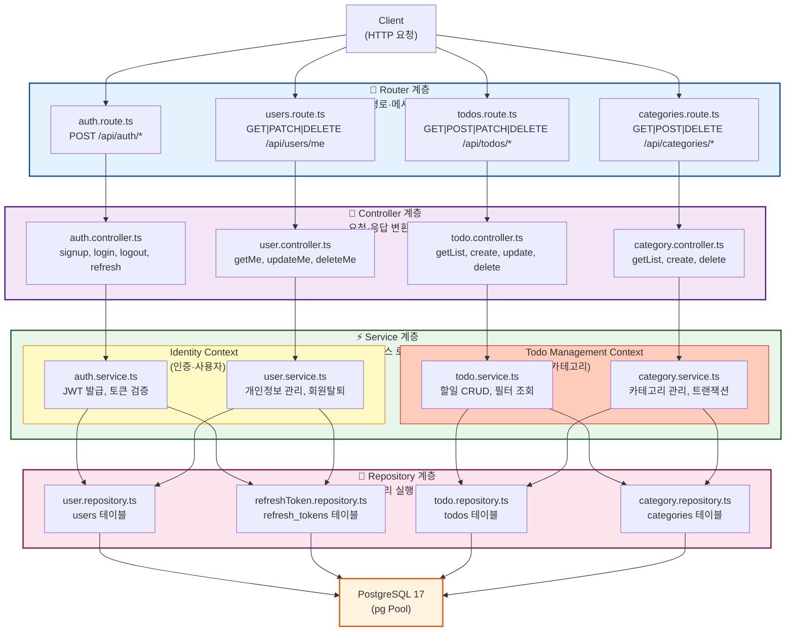
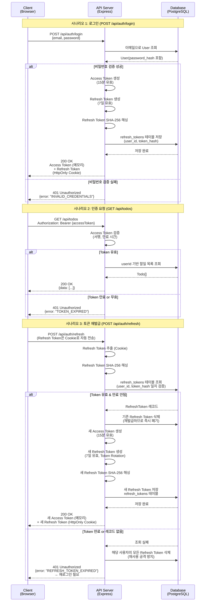

# TodoListApp 기술 아키텍처 다이어그램

> 버전: 0.1.0-draft | 작성일: 2026-05-13
>
> 참조 문서:
> - 제품 요구사항 정의서 v0.2.0-draft (`docs/2-prd.md`)
> - 프로젝트 구조 설계 원칙 v0.1.0-draft (`docs/4-project-principles.md`)

---

## 목차

1. [전체 시스템 구성 (C4 Container)](#1-전체-시스템-구성-c4-container-수준)
2. [백엔드 레이어 구조](#2-백엔드-레이어-구조)
3. [인증 흐름 (JWT)](#3-인증-흐름-jwt)

---

## 1. 전체 시스템 구성 (C4 Container 수준)

**설명**: TodoListApp의 최상위 시스템 구조. 사용자, 프론트엔드, 백엔드, 데이터베이스 4개 구성요소 간의 통신 흐름을 표현합니다.

### 구성요소 설명

| 구성요소 | 역할 | 주요 기술 |
|---------|------|---------|
| **User** | 직장인 대상 웹 애플리케이션 사용자 | Chrome, Safari, Firefox (최신 2 메이저 버전) |
| **Frontend** | 인증된 사용자를 위한 반응형 웹 UI | React 19, TypeScript, Zustand, TanStack Query |
| **Backend** | 비즈니스 로직 및 데이터 접근 제어 | Express.js, JWT 인증, 트랜잭션 처리 |
| **Database** | 사용자, 할일, 카테고리, 토큰 데이터 저장 | PostgreSQL 17, pg 라이브러리 (ORM 미사용) |

---

## 2. 백엔드 레이어 구조

**설명**: Express 백엔드의 4계층 구조와 Bounded Context 분리를 표현합니다.

### 레이어별 책임 및 통신

| 계층 | 책임 | 핵심 규칙 |
|------|------|---------|
| **Router** | HTTP 메서드·경로 정의, 미들웨어 체인 | 인증 미들웨어, Rate Limiting, 스키마 검증 |
| **Controller** | HTTP 요청 파싱, Service 호출, 응답 직렬화 | `req`, `res`, `next` 객체만 다룸 |
| **Service** | 비즈니스 로직, 도메인 규칙 검증, 트랜잭션 관리 | BR-01~BR-08 구현, 원자성 보장 |
| **Repository** | DB 쿼리 작성 및 실행, 결과 매핑 | `pg` 라이브러리 직접 사용, ORM 미사용; Pool 설정: `max: 20~30`, `idleTimeoutMillis: 30000` |

### Bounded Context 경계

- **Identity Context**: 회원가입, 로그인, 토큰 관리, 개인정보 수정, 회원탈퇴
- **Todo Management Context**: 할일 CRUD, 카테고리 관리, 필터 조회
- 두 컨텍스트는 JWT 인증 미들웨어를 경계로 연결 (userId만 신뢰)

---

## 3. 인증 흐름 (JWT)

**설명**: JWT 기반 인증의 3가지 주요 시나리오: 로그인, 인증 요청, 토큰 재발급.

### 인증 정책 요약

| 항목 | 정책 | 비고 |
|------|------|------|
| **Access Token** | 15분 유효, 메모리 저장 | XSS 공격 방어 (localStorage 미사용) |
| **Refresh Token** | 7일 유효, HttpOnly Cookie | CSRF/XSS 방어, JavaScript 접근 불가 |
| **Token Rotation** | 재발급 시 기존 토큰 즉시 삭제 | 토큰 재사용 공격(token reuse) 방지 |
| **만료 감지** | 만료된 토큰 재발급 시 사용자 모든 토큰 폐기 | 계정 탈취 감지 시 빠른 대응 |
| **서명 검증** | JWT 서명 검증 필수 (HS256) | 토큰 위변조 방지 |

---

## 변경 이력

| 버전 | 날짜 | 작성자 | 변경 내용 |
|------|------|--------|---------|
| 0.1.0-draft | 2026-05-13 | MinYoung | 최초 작성 (Mermaid 3개 다이어그램: 전체 시스템, 백엔드 레이어, JWT 인증 흐름) |
