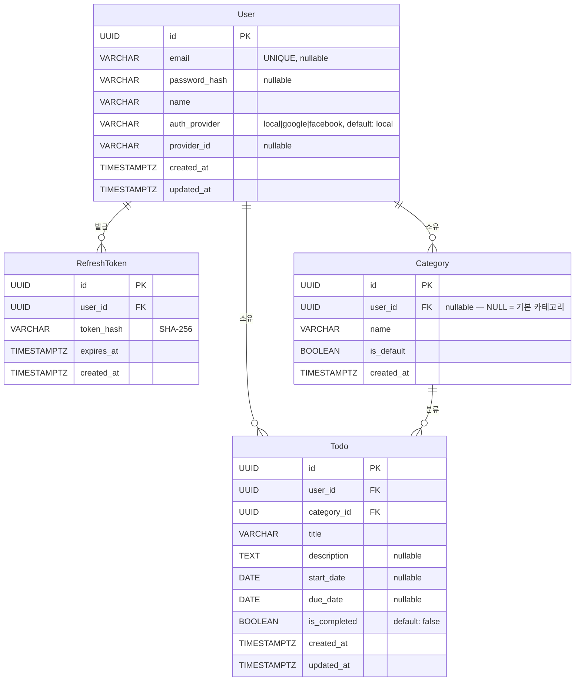

# TodoListApp — ERD (Entity Relationship Diagram)

> 버전: 0.1.0-draft | 작성일: 2026-05-13
> 참조 문서: PRD v0.1.0-draft (`docs/2-prd.md`) 섹션 10 데이터 모델

---

## 1. ERD (Mermaid erDiagram)

> 비고: `Category` 엔티티에서 `user_id = NULL` 인 레코드는 시스템 공용 **기본 카테고리**를 의미한다.
> 기본 카테고리는 애플리케이션 초기 데이터(seed)로 단 1건 삽입되며, 신규 사용자 가입 시 별도 생성하지 않는다.
> 따라서 `Category.user_id` → `User.id` FK는 NULL 허용(`nullable`) 으로 선언된다.

---

## 2. 테이블 간 제약 조건 요약

| 테이블 | 컬럼 | 제약 | 비고 |
|--------|------|------|------|
| `users` | `id` | PRIMARY KEY | UUID, 자동 생성 (`gen_random_uuid()`) |
| `users` | `email` | UNIQUE, NULL 허용 | OAuth 전용 계정은 이메일 없을 수 있음 |
| `users` | `password_hash` | NULL 허용 | OAuth 사용자는 NULL |
| `users` | `name` | NOT NULL | — |
| `users` | `auth_provider` | NOT NULL, DEFAULT `'local'` | CHECK (`auth_provider` IN (`'local'`, `'google'`, `'facebook'`)) |
| `users` | `provider_id` | NULL 허용 | local 인증은 NULL |
| `users` | `created_at` | NOT NULL, DEFAULT `now()` | UTC 저장 |
| `users` | `updated_at` | NOT NULL, DEFAULT `now()` | UTC 저장, 변경 시 갱신 |
| `refresh_tokens` | `id` | PRIMARY KEY | UUID |
| `refresh_tokens` | `user_id` | NOT NULL, FK → `users(id)` | ON DELETE CASCADE |
| `refresh_tokens` | `token_hash` | NOT NULL | SHA-256 해싱값 저장 |
| `refresh_tokens` | `expires_at` | NOT NULL | UTC 기준 만료 일시 |
| `refresh_tokens` | `created_at` | NOT NULL, DEFAULT `now()` | UTC 저장 |
| `categories` | `id` | PRIMARY KEY | UUID |
| `categories` | `user_id` | NULL 허용, FK → `users(id)` | ON DELETE CASCADE; NULL = 시스템 기본 카테고리 |
| `categories` | `name` | NOT NULL | — |
| `categories` | `is_default` | NOT NULL, DEFAULT `false` | 기본 카테고리는 `true` |
| `categories` | `created_at` | NOT NULL, DEFAULT `now()` | UTC 저장 |
| `categories` | `(user_id, name)` | UNIQUE (user_id NOT NULL 시) | 동일 사용자 내 카테고리명 중복 불가 (애플리케이션 레이어 강제 포함) |
| `todos` | `id` | PRIMARY KEY | UUID |
| `todos` | `user_id` | NOT NULL, FK → `users(id)` | ON DELETE CASCADE |
| `todos` | `category_id` | NOT NULL, FK → `categories(id)` | ON DELETE RESTRICT (BR-07: 앱 레이어에서 기본 카테고리로 재배정 후 삭제) |
| `todos` | `title` | NOT NULL | — |
| `todos` | `description` | NULL 허용 | TEXT |
| `todos` | `start_date` | NULL 허용 | DATE, UTC 기준 |
| `todos` | `due_date` | NULL 허용 | DATE, UTC 기준; CHECK (`due_date >= start_date`) |
| `todos` | `is_completed` | NOT NULL, DEFAULT `false` | — |
| `todos` | `created_at` | NOT NULL, DEFAULT `now()` | UTC 저장 |
| `todos` | `updated_at` | NOT NULL, DEFAULT `now()` | UTC 저장, 변경 시 갱신 |

---

## 3. 비즈니스 규칙 ↔ 컬럼 매핑

| 규칙 ID | 규칙 내용 | 적용 테이블 | 적용 컬럼 / 제약 | 강제 위치 |
|---------|----------|------------|----------------|-----------|
| BR-01 | 이메일 주소는 시스템 전체에서 고유해야 한다 | `users` | `email` UNIQUE | DB (UNIQUE 제약) |
| BR-02 | 인증되지 않은 사용자는 할일 및 카테고리에 접근할 수 없다 | `todos`, `categories` | — | 애플리케이션 레이어 (JWT 검증 미들웨어 → 401 응답) |
| BR-03 | 사용자는 자신이 소유한 할일과 카테고리만 조회·수정·삭제할 수 있다 | `todos`, `categories` | `user_id` FK | 애플리케이션 레이어 (요청 사용자 ID와 `user_id` 일치 검사 → 403 응답) |
| BR-04 | 할일 등록 시 카테고리는 필수이며, 기본 카테고리 또는 본인 소유 카테고리만 선택 가능하다 | `todos`, `categories` | `todos.category_id` NOT NULL; `categories.user_id` NULL or 요청자 ID | DB (NOT NULL) + 애플리케이션 레이어 (카테고리 소유권 검사) |
| BR-05 | 종료예정일은 시작일과 같거나 이후 날짜여야 한다 | `todos` | `due_date`, `start_date` | DB (CHECK `due_date >= start_date`) + 애플리케이션 레이어 (입력 유효성 검사) |
| BR-06 | 기본 카테고리는 사용자가 수정하거나 삭제할 수 없다 | `categories` | `is_default` BOOLEAN | 애플리케이션 레이어 (`is_default = true` 이면 수정·삭제 거부 → 403 응답) |
| BR-07 | 카테고리가 삭제될 경우, 해당 카테고리에 속한 할일은 기본 카테고리로 자동 재배정된다 | `todos`, `categories` | `todos.category_id` FK | 애플리케이션 레이어 (단일 DB 트랜잭션: `UPDATE todos SET category_id = <기본 카테고리 ID>` → `DELETE categories`) |
| BR-08 | 할일 목록은 카테고리 / 기간 만료 여부 / 완료 여부 기준으로 필터링할 수 있다 | `todos` | `category_id`, `due_date`, `is_completed` | 애플리케이션 레이어 (쿼리 파라미터 → SQL WHERE 조건 적용; Overdue 판단은 클라이언트 로컬 타임존 기준) |

---

## 변경 이력

| 버전 | 날짜 | 작성자 | 변경 내용 |
|------|------|--------|---------|
| 0.1.0-draft | 2026-05-13 | MinYoung | 최초 작성 — PRD v0.1.0-draft 섹션 10 기반 ERD, 제약 조건 표, BR 매핑 표 초안 |
