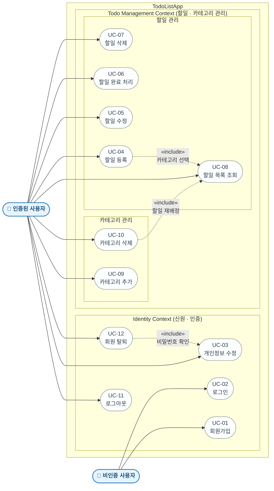

# TodoListApp Use Case Diagram

> 참조: PRD v0.2.0-draft | 작성일: 2026-05-13

---

---

## 액터 정의

| 액터 | 설명 | 접근 가능 UC |
|------|------|------------|
| 비인증 사용자 | 회원가입 또는 로그인 전 상태의 사용자 | UC-01, UC-02 |
| 인증된 사용자 | JWT 발급 후 인증된 상태의 사용자 | UC-03 ~ UC-12 |

---

## 관계 설명

| 관계 | 유형 | 설명 |
|------|------|------|
| UC-04 → UC-08 | «include» | 할일 등록 시 카테고리 선택을 위해 카테고리 목록 조회가 항상 포함됨 |
| UC-10 → UC-08 | «include» | 카테고리 삭제 시 소속 할일을 기본 카테고리로 재배정하는 처리가 항상 포함됨 (BR-07, 단일 트랜잭션) |
| UC-12 → UC-03 | «include» | 회원 탈퇴 시 본인 확인을 위한 비밀번호 검증이 항상 포함됨 |

---

## Bounded Context 경계

| Context | 포함 UC | 핵심 엔티티 |
|---------|---------|-----------|
| Identity Context | UC-01, UC-02, UC-03, UC-11, UC-12 | User, RefreshToken |
| Todo Management Context | UC-04 ~ UC-10 | Todo, Category |
